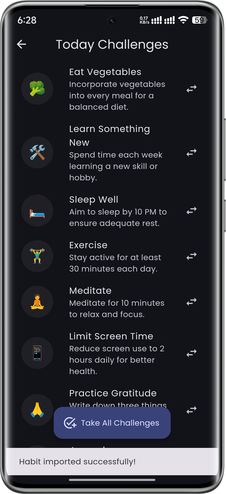

# Health Mate

Health Mate is a feature-rich mobile application designed to help users track their habits, calculate BMI, monitor the weather, customize themes, access health-related blogs, complete daily challenges, and receive AI-based health assistance.

## Features

- **User Authentication**: Sign up, log in, and manage user profiles.
- **Habit Tracker**: Add, edit, delete, and filter daily habits.
- **BMI Calculator**: Calculate BMI based on user input.
- **Weather Integration**: Get real-time weather updates.
- **Custom Themes & Modes**: Personalize the app's appearance.
- **Mindfulness Audios**: Listen to guided meditation and relaxation audios.
- **Health & Fitness Blogs**: Read curated health-related articles.
- **Daily Challenges**: Participate in new challenges every day.
- **AI Chat Assistance**: Get AI-powered health and fitness advice.

## Screenshots

### Onboarding


### Authentication


### Home


### AI Chat


### BMI Calculator


### Challenges



### Mindfulness


### Habit Tracking


### Blog


### Profile


### Themes


## Installation

### Prerequisites
- Flutter SDK installed ([Download Flutter](https://flutter.dev/docs/get-started/install))
- Dart installed
- A code editor (e.g., Visual Studio Code, Android Studio)
- Firebase configured for authentication (if applicable)

### Steps
1. Clone the repository:
   ```sh
   git clone https://github.com/H3inAK/Health-Mate.git
   ```
2. Navigate to the project directory:
   ```sh
   cd Health-Mate
   ```
3. Install dependencies:
   ```sh
   flutter pub get
   ```
4. Set up environment variables (API keys, Firebase, etc.) in a `.env` file.
5. Initialize Firebase using FlutterFire CLI:
   ```sh
   flutterfire configure
   ```
6. Get Keystore for Android Signing :
   ```sh
   keytool -list -v -keystore ~/.android/debug.keystore -alias androiddebugkey -storepass android -keypass android
   ```
5. Run the app:
   ```sh
   flutter run
   ```

## Testing

Health Mate uses **Unit Testing, Widget Testing, and Integration Testing** to ensure reliability.

### Running Tests
```sh
flutter test
```

## Technologies Used
- **Flutter** (Dart)
- **Firebase Authentication**
- **Bloc State Management**
- **Geolocator** (for weather services)
- **REST APIs** (healthmate backend api)
- **Sqflite Database** (for local storage)

## Contribution

Contributions are welcome! Follow these steps:
1. Fork the repository.
2. Create a new branch (`feature/your-feature-name`).
3. Commit your changes (`git commit -m 'Add new feature'`).
4. Push to your branch (`git push origin feature/your-feature-name`).
5. Open a pull request.

## License

This project is licensed under the  GNU GENERAL PUBLIC LICENSE. See `LICENSE` for details.
